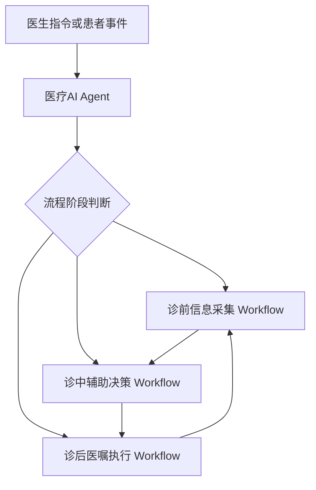

# Workflow Orchestration

## 定义

Workflow Orchestration 是本项目中 [[医疗AI Agent]] 调度 [[诊前信息采集 Workflow]]、[[诊中辅助决策 Workflow]] 和 [[诊后医嘱执行 Workflow]] 的工程组织方式。

它服务于 [[医生AI Copilot]] 的核心目标：把诊前、诊中、诊后的任务串联成 [[连续照护闭环]]。

## 在本项目中的作用

- 判断当前任务属于诊前、诊中还是诊后。
- 将医生指令、患者上下文和任务状态路由到对应 Workflow。
- 管理 Workflow 之间的输入输出衔接。
- 在关键节点触发 [[Human-in-the-loop]] 医生审核。
- 让 [[Memory]]、[[Tool Calling]]、[[RAG]] 等能力按流程需要被调用。

## 解决的问题

- 避免三个 Workflow 各自孤立，无法形成闭环。
- 避免 Agent 自由执行导致流程失控。
- 避免诊前信息无法进入诊中、诊后反馈无法回流诊前。
- 明确医生审核点、工具调用点和状态更新点。

## 设计思路

基础调度逻辑：

1. 接收医生指令、患者状态或系统事件。
2. 读取 [[Memory]] 中的患者上下文和任务状态。
3. 判断当前流程阶段和目标任务。
4. 选择并启动对应 [[Agentic Workflow]]。
5. 在 Workflow 内调用 [[Tool Calling]]、[[RAG]] 或数据接口。
6. 将输出交给医生审核或进入下一 Workflow。
7. 将确认后的结果写回 Memory，服务后续闭环。

调度关系：

## 与现有知识节点关系

- [[医生AI Copilot]]：Workflow Orchestration 是 Copilot 的流程调度层。
- [[医疗AI Agent]]：执行调度判断和流程路由。
- [[Agentic Workflow]]：被调度和约束的具体执行单元。
- [[连续照护闭环]]：调度目标是让诊前、诊中、诊后形成闭环。
- [[Human-in-the-loop]]：在关键节点设置医生确认。
- [[Tool Calling]]：在 Workflow 中调用外部系统或任务工具。

## 备注

Workflow Orchestration 不追求复杂调度，而是优先保证医生主导、流程可控、阶段衔接清楚。
