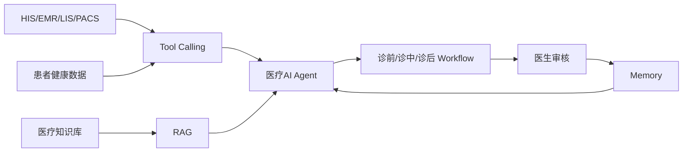

# 数据流设计

## 定义

数据流设计是指本项目中医疗数据如何从 [[HIS]]、[[EMR]]、[[LIS]]、[[PACS]]、[[患者健康数据]] 和 [[医疗知识库]] 流入 [[医疗AI Agent]]，再进入对应 Workflow 并形成医生可审核输出。

它用于说明 [[医生AI Copilot]] 的数据路径，而不是建设医院数据平台。

## 在本项目中的作用

- 明确 Copilot 从哪里获取数据。
- 明确数据如何进入诊前、诊中、诊后 Workflow。
- 支撑医生审核、过程追溯和闭环反馈。
- 为后续原型系统和技术方案提供数据路径依据。

## 解决的问题

- 医疗数据来源多，容易分散在不同系统中。
- Agent 如果没有清晰数据路径，就无法稳定支撑 Workflow。
- 诊后反馈需要回流到下一次诊前，必须设计闭环数据路径。
- 需要说明本项目依赖接口，不替代 HIS/EMR/LIS/PACS。

## 设计思路

基础数据路径：

1. [[HIS]] 提供就诊流程和业务状态。
2. [[EMR]] 提供病历、诊疗记录和历史上下文。
3. [[LIS]] 提供检验结果和异常指标。
4. [[PACS]] 提供影像报告和检查结论。
5. [[患者健康数据]] 提供诊后执行反馈和近期状态。
6. [[医疗知识库]] 通过 [[RAG]] 提供知识增强。
7. [[Tool Calling]] 将外部数据接入 [[医疗AI Agent]]。
8. Agent 根据 [[Workflow Orchestration]] 将数据送入对应 Workflow。
9. 医生通过 [[Human-in-the-loop]] 审核输出。
10. 确认结果写入 [[Memory]]，进入后续闭环。

## 与现有知识节点关系

- [[医生AI Copilot]]：数据流服务 Copilot 工作流。
- [[医疗AI Agent]]：数据汇聚和路由中心。
- [[Tool Calling]]：连接外部医疗系统。
- [[RAG]]：连接医疗知识库。
- [[Memory]]：保存确认后的上下文和状态。
- [[FHIR]]：未来可作为数据互操作标准。
- [[连续照护闭环]]：数据流最终服务跨阶段衔接。

## 备注

当前阶段可用 [[模拟数据设计]] 验证数据路径，不需要接入真实医疗系统。
