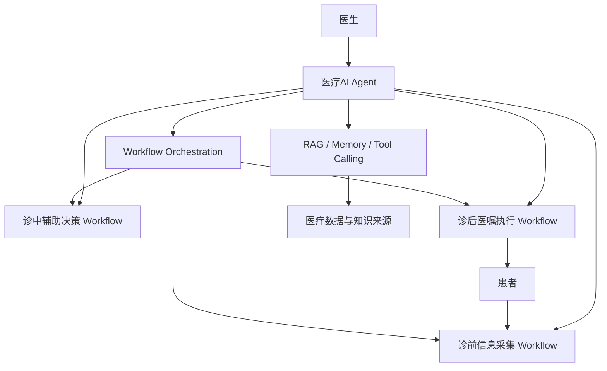

# AI先锋大赛-医生AI Copilot Agentic Workflow-知识总览

## 项目背景

本课题聚焦医疗服务流程中医生面临的信息分散、任务割裂和诊后连续管理不足的问题。

本项目的知识体系围绕一个核心方向展开：打造贯穿医生诊前、诊中、诊后的连续照护闭环。项目不追求泛医疗 AI 平台，也不替代医生，而是以 [[医生AI Copilot]] 为核心协同助手，借助 [[Agentic Workflow]] 将诊前、诊中、诊后任务组织为可控流程。

## 核心目标

围绕医生工作流程，通过医疗 Copilot Agent 辅助医生完成信息获取、临床辅助决策和诊后管理。

知识体系的建设目标，不是罗列概念，而是逐步支撑以下能力：

- 让医生在诊前更快获得患者上下文。
- 让医生在诊中更快整合知识、病历和检查结果。
- 让诊后医嘱、提醒和随访形成持续执行链条。
- 让 AI 输出始终保持医生主导、可审核、可追溯。

## 系统架构

系统架构以 [[医疗AI Agent]] 作为智能调度中枢，由三大 Workflow 承载诊疗流程，并通过医疗数据、知识库和工程机制完成闭环。

## 三大 Workflow

三大 Workflow 构成项目的业务主线：

- [[诊前信息采集 Workflow]]：收集患者信息，形成医生接诊前上下文。
- [[诊中辅助决策 Workflow]]：整合病历、检查结果和知识，为医生提供辅助判断材料。
- [[诊后医嘱执行 Workflow]]：将医嘱、提醒和随访任务转化为持续管理过程。

它们共同支撑 [[连续照护闭环]]，保证信息在诊前、诊中、诊后之间不断流转。

## AI能力支撑

AI 能力不是独立目标，而是为医生工作流提供支撑。

主要能力包括：

- [[医疗AI Agent]]：负责智能调度。
- [[RAG]]：连接 [[医疗知识库]]，为诊中辅助决策提供知识增强。
- [[Memory]]：保存跨阶段上下文，支撑连续照护。
- [[Tool Calling]]：连接外部医疗系统和任务工具。
- [[Human-in-the-loop]]：保证医生审核和医疗安全。

这些能力共同服务于 [[医生AI Copilot]]，而不是脱离 Workflow 存在。

## 医疗数据支撑

医疗数据是 Copilot 工作的基础来源，但本项目不重建医院信息化平台。

主要数据支撑节点包括：

- [[HIS]]
- [[EMR]]
- [[LIS]]
- [[PACS]]
- [[FHIR]]
- [[患者健康数据]]
- [[医疗知识库]]

其中，[[HIS]]、[[EMR]]、[[LIS]]、[[PACS]] 定位为 Copilot 的数据和工具接口来源；[[FHIR]] 定位为未来医疗数据互操作标准；[[患者健康数据]] 强调连续照护闭环的诊后反馈；[[医疗知识库]] 则为 [[RAG]] 提供知识来源。

## 工程实现

工程实现层负责把项目概念落到可验证、可演示、可评估的系统路径上。

主要节点包括：

- [[Workflow Orchestration]]：调度三大 Workflow。
- [[Agent架构设计]]：拆分医疗AI Agent 内部模块。
- [[数据流设计]]：定义 HIS/EMR/LIS/PACS 到 Agent 再到 Workflow 的数据路径。
- [[模拟数据设计]]：在无真实医疗数据情况下验证方案。
- [[评估指标]]：从技术、医疗价值、安全三个维度衡量效果。

工程层的目标不是增加复杂度，而是证明项目在医生主导下可以被组织、被执行、被评估。

## 评估体系

评估体系围绕三个维度展开：

- 技术维度：Workflow 调度、数据流完整性、上下文连续性、工具调用可用性。
- 医疗价值维度：医生负担降低、信息整合效率、诊后管理连续性、复诊回流质量。
- 安全维度：医生审核覆盖率、越权控制、可追溯性、隐私最小必要原则、异常处理能力。

对应知识节点为 [[评估指标]]，并可借助 [[模拟数据设计]] 进行可重复验证。

## 现有知识入口

当前知识体系已经形成以下层次：

- 项目核心定义：[[AI先锋大赛-医生AI Copilot Agentic Workflow-项目核心定义]]
- 知识规划：[[AI先锋大赛-医生AI Copilot Agentic Workflow-知识地图]]
- 知识建设路线：[[AI先锋大赛-医生AI Copilot Agentic Workflow-知识建设路线图]]
- 核心概念：[[医生AI Copilot]]、[[连续照护闭环]]、[[Agentic Workflow]]
- Workflow 层：[[诊前信息采集 Workflow]]、[[诊中辅助决策 Workflow]]、[[诊后医嘱执行 Workflow]]
- AI 能力层：[[医疗AI Agent]]、[[RAG]]、[[Memory]]、[[Tool Calling]]、[[Human-in-the-loop]]
- 医疗数据层：[[HIS]]、[[EMR]]、[[LIS]]、[[PACS]]、[[FHIR]]、[[患者健康数据]]、[[医疗知识库]]
- 工程实现层：[[Workflow Orchestration]]、[[Agent架构设计]]、[[数据流设计]]、[[模拟数据设计]]、[[评估指标]]

## 使用方式

本文件作为课题知识体系入口，适合在以下场景中优先查看：

- 快速理解项目全貌。
- 查找某个知识节点属于哪一层。
- 从项目视角进入具体 Wiki。
- 组织技术方案、开题报告和答辩表达。

## 备注

本总览只做入口和索引，不新增新的知识方向。所有内容都应继续回到“打造贯穿医生诊前、诊中、诊后的连续照护闭环”这一主线。
