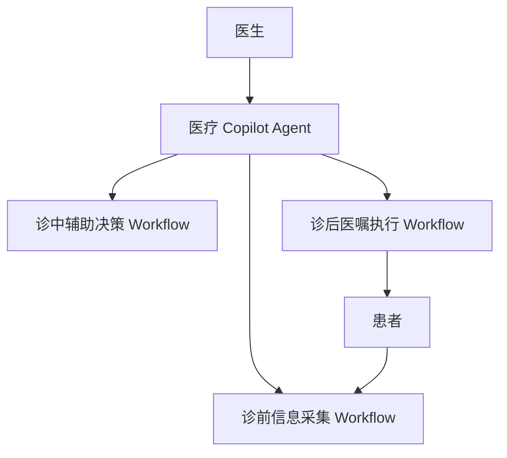

# 医生AI Copilot Agentic Workflow

## 文件定位

本文是“医生AI Copilot Agentic Workflow”项目在本知识库中的最高约束文件。

后续所有项目笔记、Wiki 知识整理、技术方案、开题报告、答辩材料和输出成果，均应围绕本文定义展开，不重新定义项目方向。

## 项目名称

医生AI Copilot Agentic Workflow

## 项目定位

打造贯穿医生诊前、诊中、诊后的连续照护闭环。

本项目关注医疗服务流程中的信息获取、临床辅助决策和诊后管理，目标是让 AI 作为医生工作流程中的协同助手，而不是脱离医疗流程独立运行的自动化系统。

## 核心目标

围绕医生工作流程，通过医疗 Copilot Agent 辅助医生完成信息获取、临床辅助决策和诊后管理。

具体目标包括：

- 降低医生在诊前、诊中、诊后环节中的信息处理负担。
- 提高医疗服务在不同阶段之间的连续性。
- 将患者信息、医疗知识、医嘱任务和随访管理组织为可执行的 Workflow。
- 在医生主导下提供可控、可追溯、可协同的 AI 辅助能力。

## 核心架构

医疗 Copilot Agent 作为智能调度中枢。

医疗 Copilot Agent 负责根据医生工作场景、患者信息和任务状态，调度不同 Workflow，辅助医生完成连续照护流程中的关键任务。

下挂核心 Workflow：

- 诊前信息采集 Workflow
- 诊中辅助决策 Workflow
- 诊后医嘱执行 Workflow

基础结构：

## 用户角色

### 医生

核心使用者和决策者。

医生负责提出需求、审核 AI 辅助结果、完成临床判断，并对最终医疗决策负责。医疗 Copilot Agent 的作用是辅助医生提高信息处理效率和流程管理能力。

### 患者

医疗服务流程参与者。

患者提供诊前信息、健康状态、医嘱执行反馈和随访数据。患者侧信息进入 Workflow 后，应服务于医生判断和连续照护管理。

## 项目边界

本项目明确不是：

- 替代医生
- 自动诊断系统
- HIS/EMR 替代平台
- 泛医疗 AI 平台

边界说明：

- 不替代医生的临床判断和医疗责任。
- 不以自动诊断作为核心功能或最终目标。
- 不重建医院 HIS、EMR、LIS、PACS 等核心业务系统。
- 不做脱离具体医生工作流程的泛化医疗 AI 助手。
- 不追求完全自主 Agent，而强调医生主导、人机协同、流程可控。

## 技术支撑

技术内容必须服务于项目目标，所有技术选择都应围绕“医生工作流程中的连续照护闭环”展开。

核心技术包括但不限于：

- Agent
- Agentic Workflow
- RAG
- Tool Calling
- Memory
- 医疗数据接口

技术支撑关系：

- Agent：作为医疗 Copilot 的智能中枢，负责理解任务、组织上下文和调度能力。
- Agentic Workflow：用于约束 Agent 行为，将诊前、诊中、诊后任务组织为可控流程。
- RAG：用于辅助医疗知识查询、指南检索、资料引用和上下文增强。
- Tool Calling：用于调用数据查询、任务生成、提醒、随访管理等工具能力。
- Memory：用于维护患者相关上下文、医生偏好、流程状态和历史任务记录。
- 医疗数据接口：用于连接 HIS、EMR、LIS、PACS 或模拟医疗数据源，为 Workflow 提供数据基础。

## 约束原则

- 医生始终是核心决策者。
- 患者数据使用必须遵循隐私保护和最小必要原则。
- AI 输出必须可解释、可追溯、可审核。
- Workflow 设计应优先服务真实医疗流程，而不是展示技术复杂度。
- 技术方案不得偏离“医生 AI Copilot + 多 Workflow + 连续照护闭环”的主线。
