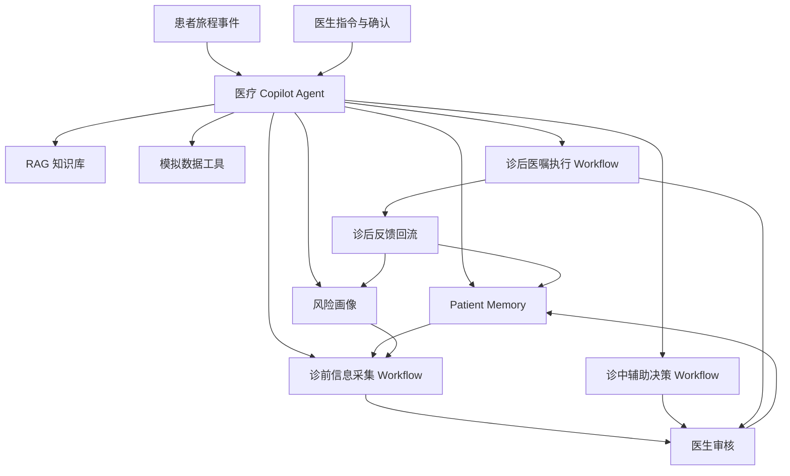

# Agent 架构强化说明

## 核心判断

本 Demo 不能讲成“诊前、诊中、诊后三个流程节点依次执行”。那样容易变成流程机器人，创新点会被压扁。

应改成：医疗 Copilot Agent 围绕同一名患者持续维护 Patient Memory，动态更新风险画像，并在医生确认后把诊后反馈回流到下一次诊前。三大 Workflow 只是 Agent 可调用的任务能力，真正的主角是“患者旅程中的连续上下文与风险演化”。

## 一句话架构

医疗 Copilot Agent = 任务理解 + Patient Memory + 风险画像 + RAG + Tool Calling + HITL。

## Agent 不是什么

- 不是固定问答机器人。
- 不是把三段表单串起来的流程机器人。
- 不是自动诊断或自动开方系统。
- 不是单次对话结束就丢失上下文的聊天入口。

## Agent 是什么

- 识别患者当前处于诊前、诊中、诊后还是下一次复诊准备。
- 读取 Patient Memory，知道这名患者过去发生了什么。
- 读取风险画像，知道医生此刻最该关注哪些风险线索。
- 调用 RAG，为医生提供可追溯知识依据。
- 调用模拟数据工具，把医嘱、反馈和异常沉淀为可追踪状态。
- 所有关键医疗输出进入 HITL，由医生确认后才写回 Memory。

## Patient Memory

Patient Memory 保存的不是原始流水账，而是医生确认后可信的患者上下文。

本 Demo 中至少维护 5 类记忆：

| 记忆类型 | 内容 | 进入条件 |
| --- | --- | --- |
| 基线记忆 | 年龄、性别、高血压病史、当前用药 | 初始病例数据 |
| 就诊记忆 | 本次主诉、近期血压、补充问题 | 诊前摘要经医生确认 |
| 决策记忆 | 医生确认后的管理计划 | 诊中 HITL 确认 |
| 执行记忆 | 7 天用药、监测、生活方式执行状态 | 诊后事件流汇总 |
| 回流记忆 | 漏服、症状变化、血压趋势、复诊关注点 | 诊后异常经医生确认 |

## 风险画像

风险画像不是诊断结论，而是 Agent 帮医生维护的关注优先级。

本 Demo 中风险画像包含：

- 血压控制风险：家庭血压多次偏高。
- 依从性风险：近两周漏服 2 次，诊后第 4 天再次漏服。
- 症状风险：头晕存在波动，第 3 天一度加重。
- 生活方式风险：高盐、睡眠不足、运动不规律。
- 复诊准备风险：需要带回 7 天血压记录和异常反馈。

风险画像只用于提示医生重点核对，不自动触发治疗调整。

## 最大创新点

最大创新点不是“能生成诊前摘要”“能查指南”“能拆任务”，而是：

**诊后反馈回流改变下一次诊前。**

传统 Demo 容易在诊后任务生成处结束。本项目要继续往前走一步：把患者真实执行情况、漏服、症状、血压趋势和异常确认写入 Patient Memory，下一次复诊时，Agent 自动把这些内容放到诊前摘要最前面，帮助医生带着连续上下文接诊。

## Demo 叙事改法

不要按“功能 1、功能 2、功能 3”讲。

改成按“王某的一次医疗旅程”讲：

1. 王某带着近两周血压偏高和头晕来到复诊前。
2. Agent 读取 Patient Memory，发现既往高血压、氨氯地平用药、近期漏服和血压趋势。
3. 医生确认诊前摘要，Agent 才把可信上下文带入诊中。
4. 诊中 Agent 基于 RAG 和风险画像生成供医生核对的管理方向。
5. 医生确认医嘱后，Agent 将计划转成诊后任务。
6. 7 天后患者反馈进入 Memory，风险画像被更新。
7. 下一次诊前，Agent 主动提示医生：这名患者上次诊后有漏服、血压仍偏高、曾有头晕加重，应重点核对依从性和异常变化。

这才是 Agent 架构，而不是流程机器人。
