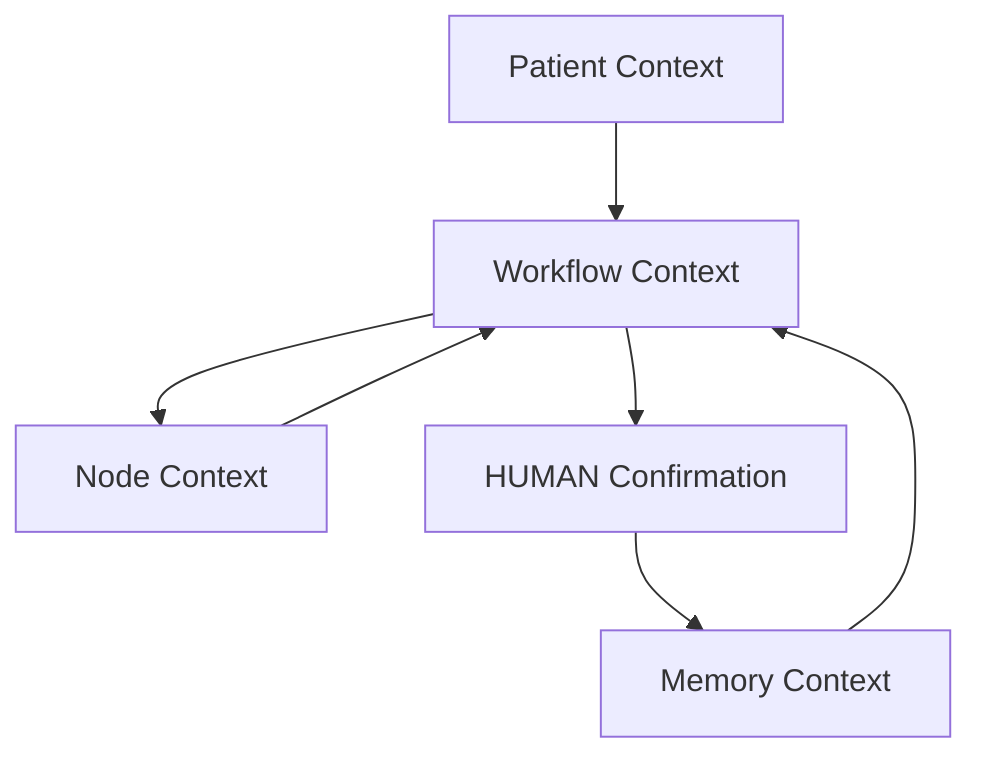
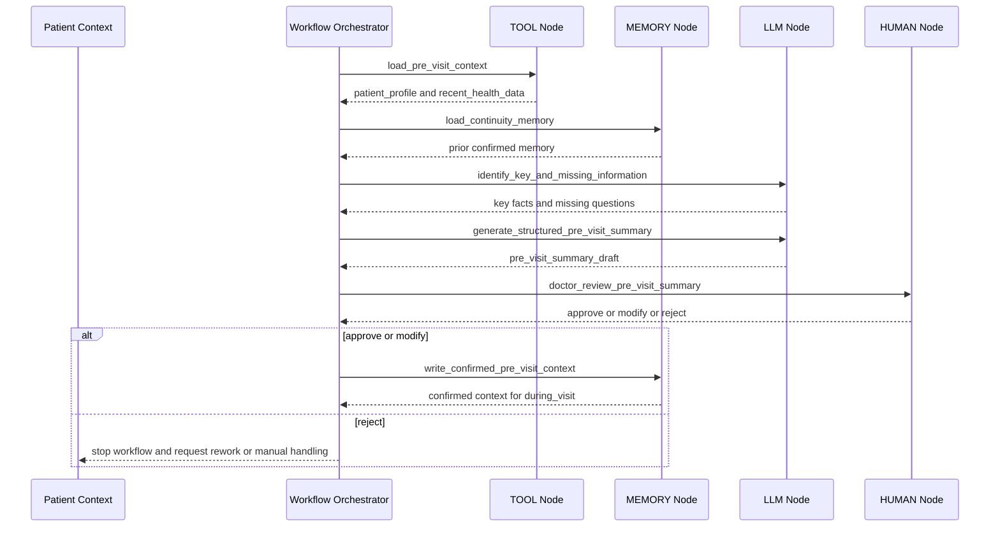
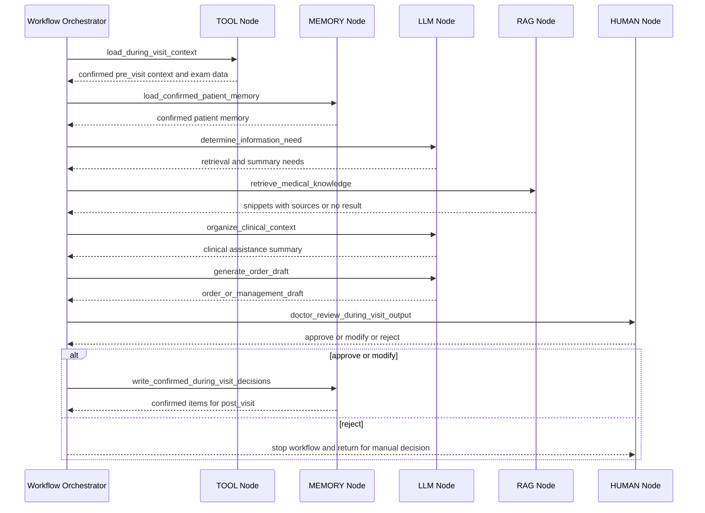
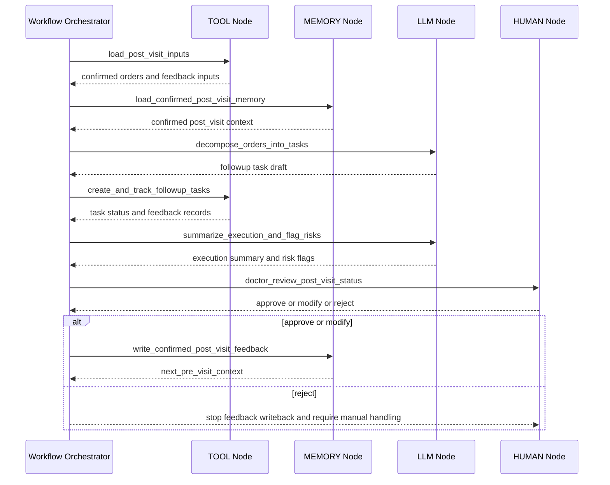

# Agent Orchestration Spec

## 1. Workflow执行模型

Workflow Orchestrator 负责读取 `04_Output/Demo实施包/workflows/` 下的 Workflow Definition，并按 YAML 中声明的节点顺序执行。

输入文件：

- `pre_visit.yaml`
- `during_visit.yaml`
- `post_visit.yaml`

Orchestrator 读取规则：

1. 读取 `workflow_name`，确定当前 Workflow 身份。
2. 读取 `business_goal`，作为执行边界和输出目标。
3. 读取 `input_data`，校验启动 Workflow 所需的上下文是否存在。
4. 读取 `nodes`，按声明顺序执行节点。
5. 读取 `hitl_confirmation_points`，在对应 HUMAN 节点暂停自动推进。
6. 读取 `output_data`，校验最终输出是否完整。
7. 读取 `guardrails`，作为全流程硬约束。

全局执行原则：

- 医生始终是最终决策者。
- AI 只做信息整理、知识检索、草稿生成、任务拆解和反馈摘要。
- 不允许自动诊断。
- 不允许自动处方。
- 不允许自动修改治疗方案。
- 未经医生确认的内容不得进入可信 Memory，也不得驱动后续医疗流程。

Workflow 启动条件：

| Workflow | 启动条件 | 前置确认 |
| --- | --- | --- |
| `pre_visit` | 患者进入诊前采集或复诊准备阶段 | 可读取患者基础资料与既往 Memory |
| `during_visit` | 医生开始接诊并需要使用诊前上下文 | 诊前摘要已由医生确认或显式标记为待核对输入 |
| `post_visit` | 医生完成诊中确认并给出管理计划 | 医嘱或管理任务已由医生确认 |

Workflow 结束条件：

- 当前 Workflow 的 `output_data` 已生成。
- 所有 `hitl_confirmation_points` 均已处理。
- 需要写入 Memory 的内容均来自医生确认结果。
- 若医生拒绝关键输出，则当前 Workflow 停止或回到指定节点重做。

## 2. Node执行规范

### LLM Node

输入：

- Patient Context
- Workflow Context
- Node Context
- 已确认 Memory Context
- 上游节点输出
- 当前节点任务说明

处理逻辑：

- 执行信息识别、摘要生成、结构化整理、医嘱草稿生成、任务拆解或风险标记。
- 输出必须使用“供医生核对的辅助草稿”语气。
- 遇到缺失信息时提出补充问题，不编造。
- 对诊疗相关内容标注不确定性和需医生判断事项。

输出：

- 结构化摘要
- 辅助判断材料
- 医嘱或管理任务草稿
- 缺失信息问题
- 风险或异常提示

失败处理：

- 若模型调用失败，返回 `llm_failed`，保留上游上下文，不推进到 HUMAN 或 MEMORY。
- 若输出缺少关键字段，返回 `llm_output_incomplete`，要求重新生成或人工接管。
- 若输出包含自动诊断、自动处方、自动改药内容，标记为 `guardrail_violation`，丢弃该输出并进入医生接管。

### RAG Node

输入：

- 医生问题
- Workflow Context
- 已确认患者上下文
- 检索查询词
- 医疗知识库配置

处理逻辑：

- 检索与当前医生问题、患者上下文或管理任务相关的知识片段。
- 返回片段标题、来源和要点。
- 不把检索结果转化为最终医疗结论。
- 未检索到充分依据时必须显式说明。

输出：

- knowledge_snippets
- source_titles
- source_references
- retrieval_status

失败处理：

- 若检索失败，返回 `rag_failed`，允许 LLM 仅基于已确认上下文生成“缺少知识依据”的整理草稿。
- 若无结果，返回 `no_retrieval_result`，不得编造来源。
- 若来源不完整，标记 `source_incomplete`，输出必须提示医生人工核对。

### TOOL Node

输入：

- patient_id
- Workflow Context
- Node Context
- 工具名称和参数
- 上游节点确认结果

处理逻辑：

- 读取模拟患者档案、检查数据、随访任务、反馈事件或其他结构化数据。
- 写入类工具只能在医生确认后执行。
- 工具返回值必须进入 Node Context，供后续节点引用。

输出：

- tool_result
- tool_status
- structured_data
- error_detail

失败处理：

- 若工具不可用，返回 `tool_failed`，保留当前 Workflow 状态。
- 若数据不存在，返回 `data_not_found`，转入数据缺失处理。
- 若写入工具缺少医生确认凭证，返回 `confirmation_required`，禁止写入。

### HUMAN Node

输入：

- AI 生成的摘要、提示、草稿或异常标记
- RAG 来源
- 工具结果
- 当前 Workflow 状态
- 需要医生确认的问题

处理逻辑：

- 暂停自动执行。
- 将 AI 输出提交医生审核。
- 接收医生确认结果：`approve`、`modify`、`reject`。
- 将医生确认结果作为后续流程的唯一可信依据。

输出：

- human_decision
- confirmed_content
- modified_content
- rejection_reason
- doctor_confirmation_id

失败处理：

- 若医生未确认，Workflow 停止在当前 HUMAN 节点。
- 若医生选择 `reject`，不得写入 Memory，不得进入下一医疗阶段。
- 若医生选择 `modify`，后续节点只能使用医生修改后的内容。

### MEMORY Node

输入：

- doctor_confirmation_id
- confirmed_content
- Memory Context
- Workflow Context
- 写入范围

处理逻辑：

- 读取已确认的连续照护上下文。
- 仅写入医生确认后的摘要、管理计划、异常反馈或回流内容。
- 区分草稿上下文和可信 Memory。
- 为下一阶段 Workflow 提供已确认上下文。

输出：

- memory_read_result
- memory_update_patch
- updated_memory_context
- memory_status

失败处理：

- 若读取失败，返回 `memory_read_failed`，允许继续生成草稿但必须提示上下文不完整。
- 若写入失败，返回 `memory_write_failed`，不得假定 Memory 已更新。
- 若缺少医生确认凭证，返回 `memory_write_blocked`，禁止写入。

## 3. Context传递规范

### Patient Context

Patient Context 表示患者在当前 Demo 中的基础事实与医疗旅程信息。

包含：

- 患者基础信息
- 主诉和症状描述
- 既往史、过敏史、用药史
- 近期健康数据
- 检查或随访资料
- 诊后反馈事件

用途：

- 作为 Workflow 的业务输入。
- 不直接等同于可信 Memory。
- 未经医生确认的患者自述可用于草稿，但不能直接成为后续医疗决定依据。

### Workflow Context

Workflow Context 表示一次 Workflow 执行期间的状态。

包含：

- workflow_name
- business_goal
- input_data
- 当前节点位置
- 上游节点输出
- HITL 状态
- 最终输出草稿

用途：

- 支撑节点间传递。
- 决定当前 Workflow 是否可继续执行。
- 记录失败、暂停、拒绝或完成状态。

### Node Context

Node Context 表示单个节点执行时的局部上下文。

包含：

- node_name
- node_type
- node_input
- node_output
- node_status
- error_detail

用途：

- 隔离单节点输入输出。
- 为失败重试或人工排查提供最小上下文。
- 避免节点越权读取或写入不相关信息。

### Memory Context

Memory Context 表示经过医生确认后可复用的连续照护上下文。

包含：

- baseline_memory
- pre_visit_memory
- in_visit_memory
- post_visit_memory
- next_pre_visit_summary
- doctor_confirmation_id

用途：

- 支撑跨 Workflow 的连续照护。
- 作为下一次诊前优先读取的可信上下文。
- 只保存医生确认后的关键内容，不保存未经确认的 AI 草稿。

Context 关系：

## 4. HITL执行规范

必须医生确认的节点：

| Workflow | HUMAN 节点 | 必须确认的内容 |
| --- | --- | --- |
| `pre_visit` | `doctor_review_pre_visit_summary` | 诊前摘要、关键问题、缺失信息问题 |
| `during_visit` | `doctor_review_during_visit_output` | 诊中辅助摘要、知识依据、医嘱或管理任务草稿 |
| `post_visit` | `doctor_review_post_visit_status` | 诊后异常标记、执行摘要、回流 Memory 内容 |

医生确认结果：

| 结果 | 含义 | 后续影响 |
| --- | --- | --- |
| `approve` | 医生认可当前输出 | 输出进入下一节点；可写入可信 Memory；可传递到下一 Workflow |
| `modify` | 医生修改后认可 | 丢弃原 AI 草稿中被修改部分；仅使用医生修改后的内容继续执行 |
| `reject` | 医生拒绝当前输出 | 停止当前分支；禁止写入 Memory；禁止进入下一医疗阶段 |

HITL 执行规则：

- HUMAN 节点必须暂停自动推进。
- HUMAN 节点之后的 MEMORY 写入必须带 `doctor_confirmation_id`。
- `during_visit` 中的医嘱草稿未经医生确认，不得进入 `post_visit`。
- `post_visit` 中的异常摘要未经医生确认，不得写入下一次诊前 Memory。
- 医生拒绝时，Orchestrator 只能返回重做、补充数据或人工接管状态。

## 5. Error Handling

### RAG失败

处理方式：

- 标记 `rag_failed`。
- 保留医生问题和患者上下文。
- 允许生成不带知识依据的整理草稿，但必须明确“未检索到充分来源”。
- 涉及诊疗方向时必须进入 HUMAN 节点，由医生人工判断。

### Tool失败

处理方式：

- 标记 `tool_failed`。
- 停止依赖该工具结果的后续节点。
- 若为读取失败，提示缺少对应数据。
- 若为写入失败，不得假定数据已保存。
- 可切换到固定模拟数据或人工录入，但必须标记来源。

### LLM失败

处理方式：

- 标记 `llm_failed`。
- 不生成替代性医疗结论。
- 保留上游结构化数据，允许医生人工查看。
- 可重试同一节点；重试后仍失败则人工接管。

### 数据缺失

处理方式：

- 标记 `data_missing`。
- 生成补充问题或待核对字段。
- 不得编造病史、检查结果、用药情况或患者反馈。
- 若缺失数据影响诊疗判断，必须交由医生确认。

### 人工拒绝

处理方式：

- 标记 `human_rejected`。
- 停止当前 Workflow 的自动推进。
- 禁止写入 Memory。
- 禁止将被拒绝内容传递到下一 Workflow。
- 根据医生意见回到指定节点重做，或转人工处理。

## 6. 三个Workflow执行时序图

### Pre-visit Workflow

### During-visit Workflow

### Post-visit Workflow

