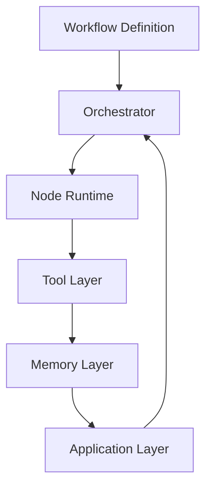
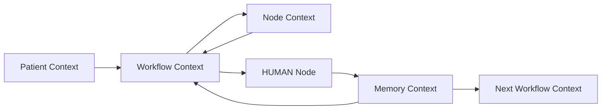

# Runtime Architecture Spec

本文定义医疗 Agentic Workflow Runtime 的工程架构。本文只描述 Runtime 设计，不开发代码，不创建 API，不创建前端。

## 1. Runtime总体架构

Runtime 负责把已完成的规格资产组织成可执行的工程结构。它不改变医疗业务逻辑，只承接 Workflow Definition、Agent Orchestration Specification 与 Tool Contract Specification 中已经定义的行为边界。

总体结构：

层级说明：

| 层级 | 职责 |
| --- | --- |
| Workflow Definition | 保存 `pre_visit.yaml`、`during_visit.yaml`、`post_visit.yaml`，定义 Workflow 名称、目标、输入、节点、输出和 HITL 位置。 |
| Orchestrator | 读取 Workflow YAML，创建 Workflow 实例，调度节点执行，处理暂停、失败、重试和终止。 |
| Node Runtime | 执行五类节点：LLM、RAG、TOOL、HUMAN、MEMORY，并维护节点状态。 |
| Tool Layer | 根据 `tool_contracts.yaml` 执行工具适配、参数校验、权限检查和审计记录。 |
| Memory Layer | 管理 Patient Memory 的读取和医生确认后的写回。 |
| Application Layer | 承载医生审核、患者输入、演示交互和结果展示；该层只消费 Runtime 状态，不替代医生决策。 |

全局边界：

- 医生主导。
- AI 辅助。
- 不可自动诊断。
- 不可自动处方。
- 不可自动修改治疗方案。
- 医生确认是可信状态写入前置条件。

## 2. Workflow Engine

Workflow Engine 是 Orchestrator 内部负责 Workflow 生命周期管理的组件。

### 加载Workflow YAML

加载流程：

1. 从 `04_Output/Demo实施包/workflows/` 读取 Workflow YAML。
2. 校验必需字段：`workflow_name`、`business_goal`、`input_data`、`nodes`、`output_data`、`hitl_confirmation_points`。
3. 校验节点类型只能为 `LLM`、`RAG`、`TOOL`、`HUMAN`、`MEMORY`。
4. 校验 `hitl_confirmation_points` 指向的节点存在，且节点类型为 `HUMAN`。
5. 加载 `guardrails`，作为 Runtime 执行时硬约束。

### 创建Workflow实例

实例创建内容：

- workflow_id
- workflow_name
- patient_id
- workflow_stage
- initial_patient_context
- initial_memory_context
- node_list
- current_node_index
- workflow_status
- created_at

实例状态：

| 状态 | 含义 |
| --- | --- |
| `created` | Workflow 实例已创建，尚未开始执行。 |
| `running` | Workflow 正在执行非 HUMAN 节点。 |
| `waiting_for_human` | Workflow 暂停在医生确认节点。 |
| `completed` | Workflow 已完成，输出可交给下一阶段。 |
| `failed` | Workflow 因节点失败或安全约束失败而停止。 |
| `rejected` | 医生拒绝关键输出，Workflow 停止自动推进。 |

### 执行节点

执行流程：

1. 读取当前节点定义。
2. 创建 Node Context。
3. 根据 `node_type` 路由到对应 Node Runtime。
4. 执行节点输入校验。
5. 执行节点处理逻辑。
6. 保存节点输出与状态。
7. 若节点为 `HUMAN`，暂停 Workflow。
8. 若节点失败，进入 Error Handling。
9. 若节点成功，推进到下一节点。

### 保存状态

Workflow Engine 必须保存：

- Workflow ID
- 当前节点
- 节点输入
- 节点输出
- 节点状态
- Tool 调用结果
- AI 输出
- 医生确认结果
- Memory 读取和写回结果
- 错误信息
- 时间戳

状态保存原则：

- AI 草稿与医生确认内容必须分开保存。
- 未确认内容不得标记为可信状态。
- Memory 写回必须关联 `doctor_confirmation_id`。

### 处理失败

失败处理遵循 Agent Orchestration Specification 和 Tool Contract Specification。

通用处理：

- 记录失败节点和错误原因。
- 停止依赖失败输出的后续节点。
- 不生成替代性医疗结论。
- 对诊疗相关影响进入 HUMAN 节点或人工接管。
- 写入失败不得假定成功。

## 3. Node Runtime

Node Runtime 负责执行单个节点。所有节点都必须接受 Node Context，并返回节点输出和状态变化。

### LLM Node

输入：

- Patient Context
- Workflow Context
- Node Context
- Memory Context
- 上游节点输出
- 当前节点 purpose

处理：

- 识别关键信息、缺失信息或风险线索。
- 生成结构化摘要、辅助草稿、任务拆解或异常摘要。
- 明确输出为供医生核对的辅助材料。
- 检查输出是否违反自动诊断、自动处方、自动改药边界。

输出：

- llm_output
- uncertainty_notes
- missing_information_questions
- guardrail_check_result

状态变化：

- `pending` -> `running`
- `running` -> `succeeded`
- `running` -> `failed`
- `running` -> `guardrail_blocked`

### RAG Node

输入：

- query
- Patient Context
- Workflow Context
- medical_knowledge_sources

处理：

- 检索 Demo 医疗知识片段。
- 返回来源标题、来源说明和摘要要点。
- 无结果时明确标记，不编造来源。

输出：

- retrieved_snippets
- source_references
- retrieval_status

状态变化：

- `pending` -> `running`
- `running` -> `succeeded`
- `running` -> `no_result`
- `running` -> `failed`

### TOOL Node

输入：

- tool_name
- tool_input
- Workflow Context
- Node Context
- Tool Contract

处理：

- 从 `tool_contracts.yaml` 读取工具契约。
- 校验输入 schema。
- 校验 permission。
- 校验是否需要医生确认。
- 执行工具适配逻辑。
- 记录工具审计日志。

输出：

- tool_result
- tool_status
- error_detail

状态变化：

- `pending` -> `running`
- `running` -> `succeeded`
- `running` -> `failed`
- `running` -> `blocked_by_permission`
- `running` -> `blocked_by_missing_confirmation`

### HUMAN Node

输入：

- AI 输出草稿
- RAG 来源
- Tool 结果
- Workflow Context
- 需要医生确认的问题

处理：

- 暂停自动执行。
- 等待医生确认。
- 接收 `approve`、`modify`、`reject`。
- 将医生确认结果写入 Workflow Context。

输出：

- human_decision
- confirmed_content
- modified_content
- rejection_reason
- doctor_confirmation_id

状态变化：

- `pending` -> `waiting_for_human`
- `waiting_for_human` -> `approved`
- `waiting_for_human` -> `modified`
- `waiting_for_human` -> `rejected`

### MEMORY Node

输入：

- patient_id
- Memory Context
- confirmed_content
- doctor_confirmation_id
- memory_operation

处理：

- 读取可信 Patient Memory。
- 校验写入是否具备医生确认。
- 生成 memory_update_patch。
- 只写入医生确认后的内容。
- 保留写回审计记录。

输出：

- memory_read_result
- memory_update_patch
- updated_memory_context
- memory_status

状态变化：

- `pending` -> `running`
- `running` -> `succeeded`
- `running` -> `failed`
- `running` -> `blocked_by_missing_confirmation`

## 4. Context Management

Runtime 使用四类 Context 管理医疗旅程。

### Patient Context

Patient Context 是患者事实数据和患者侧输入的集合。

来源：

- 患者基础资料
- 患者主诉
- 既往史和用药史
- 近期血压等健康数据
- 随访反馈事件

使用边界：

- 可用于 AI 草稿生成。
- 不自动成为可信 Memory。
- 不直接触发医疗决定。

### Workflow Context

Workflow Context 是单次 Workflow 实例的运行状态。

包含：

- workflow_id
- workflow_name
- workflow_stage
- current_node
- node_outputs
- hitl_status
- workflow_status
- error_state

作用：

- 控制节点推进。
- 承接节点输出。
- 保存暂停、失败、拒绝和完成状态。

### Node Context

Node Context 是单个节点执行时的局部状态。

包含：

- node_id
- node_name
- node_type
- node_input
- node_output
- node_status
- error_detail

作用：

- 隔离节点输入输出。
- 支持节点重试。
- 支持审计追踪。

### Memory Context

Memory Context 是经过医生确认后可跨阶段复用的可信上下文。

包含：

- baseline_memory
- pre_visit_memory
- in_visit_memory
- post_visit_memory
- next_pre_visit_summary
- doctor_confirmation_id

写入条件：

- 必须来自 HUMAN Node 的 `approve` 或 `modify`。
- 必须带 `doctor_confirmation_id`。
- 不允许写入未经确认的 AI 草稿。

Context 关系：

## 5. Audit与安全

Runtime 必须记录完整审计链路，用于说明每个输出来自哪里、是否经过医生确认、是否写入 Memory。

必须记录：

- Workflow ID
- Node ID
- Tool 调用
- AI 输出
- 医生确认
- Memory 写回

审计字段：

| 对象 | 必需记录 |
| --- | --- |
| Workflow | workflow_id、workflow_name、patient_id、workflow_stage、status、created_at、updated_at |
| Node | node_id、node_name、node_type、input、output、status、error_detail、started_at、ended_at |
| Tool 调用 | tool_name、input、output、called_at、workflow_stage、workflow_node、permission_check_result |
| AI 输出 | prompt_context、model_output、guardrail_check_result、created_at |
| 医生确认 | human_decision、confirmed_content、doctor_confirmation_id、confirmed_at |
| Memory 写回 | memory_update_patch、doctor_confirmation_id、write_status、written_at |

安全规则：

- 医生确认是可信状态写入前置条件。
- `update_patient_memory` 缺少 `doctor_confirmation_id` 时必须被阻断。
- `create_followup_tasks` 只能基于医生确认后的医嘱或管理计划生成任务。
- Tool 调用结果不得直接成为医疗结论。
- RAG 结果不得替代医生判断。
- LLM 输出不得自动诊断、自动处方、自动改药或自动修改治疗方案。
- 医生拒绝后，当前输出不得写入 Memory，不得进入下一 Workflow。
