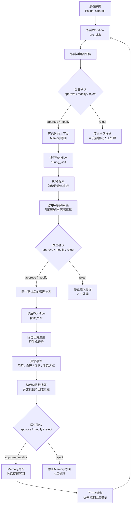
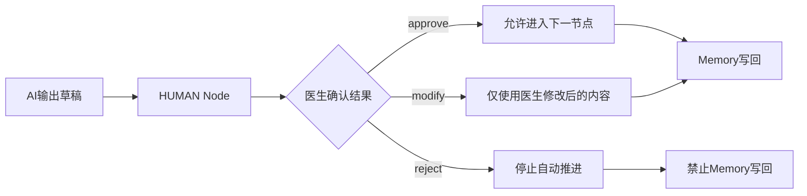

# Runtime Data Flow

本文描述一次完整医疗旅程在 Runtime 中的数据流。本文只描述数据如何流转，不实现代码、不创建 API、不创建前端。

## 完整医疗旅程

## 数据流分段说明

### 诊前阶段

输入：

- 患者基础信息
- 主诉和症状描述
- 既往史、用药史、过敏史
- 近期健康数据
- 上一次诊后反馈
- Patient Memory
- 风险画像

Runtime 流转：

1. Workflow Engine 加载 `pre_visit.yaml`。
2. TOOL Node 读取患者档案、风险画像和近期血压。
3. MEMORY Node 读取已确认的 Patient Memory。
4. LLM Node 生成诊前摘要草稿和缺失信息问题。
5. HUMAN Node 暂停，等待医生确认。
6. MEMORY Node 仅写入医生确认后的诊前上下文。

输出：

- 可信诊前上下文
- 可传递给诊中 Workflow 的确认信息

### 诊中阶段

输入：

- 医生确认后的诊前摘要
- Patient Memory
- 风险画像
- 医生问题
- 病历或检查资料
- 医疗知识库

Runtime 流转：

1. Workflow Engine 加载 `during_visit.yaml`。
2. TOOL Node 读取诊中上下文。
3. MEMORY Node 读取已确认患者上下文。
4. LLM Node 判断需要整理和检索的信息。
5. RAG Node 检索知识片段并返回来源。
6. LLM Node 生成辅助摘要和医嘱草稿。
7. HUMAN Node 暂停，等待医生确认。
8. MEMORY Node 仅写入医生确认后的管理计划和后续任务。

输出：

- 医生确认后的管理计划
- 可传递给诊后 Workflow 的确认事项

### 诊后阶段

输入：

- 医生确认后的医嘱或管理计划
- Patient Memory
- 随访任务要求
- 患者反馈事件
- 近期健康数据

Runtime 流转：

1. Workflow Engine 加载 `post_visit.yaml`。
2. TOOL Node 读取医生确认后的医嘱和反馈输入。
3. MEMORY Node 读取诊后执行所需的已确认上下文。
4. LLM Node 将医生确认后的医嘱拆解为任务草稿。
5. TOOL Node 生成随访任务并记录反馈事件。
6. LLM Node 汇总执行情况并标记异常。
7. HUMAN Node 暂停，等待医生审核异常和回流内容。
8. MEMORY Node 仅写入医生确认后的诊后反馈摘要。

输出：

- 诊后执行状态
- 异常标记
- 医生确认后的回流摘要
- 下一次诊前优先读取的 Memory Context

## 关键安全门

安全约束：

- AI 草稿不能直接写入可信 Memory。
- 医嘱草稿不能直接进入诊后任务。
- 诊后异常摘要不能直接回流到下一次诊前。
- 医生确认是可信状态写入的唯一前置条件。

## Runtime数据对象

| 数据对象 | 来源 | 使用阶段 | 是否可信 |
| --- | --- | --- | --- |
| Patient Context | 患者输入和模拟病例数据 | 诊前、诊中、诊后 | 未经医生确认前不作为可信医疗结论 |
| Workflow Context | Workflow Engine | 单个 Workflow 内 | 运行状态可信，医疗内容需区分草稿和确认结果 |
| Node Context | Node Runtime | 单个节点内 | 节点状态可信，AI 输出需医生确认 |
| Memory Context | Memory Layer | 跨 Workflow | 仅医生确认后写入的内容可信 |
| Tool Result | Tool Layer | 依工具使用阶段 | 工具返回事实可追溯，但不构成医疗决定 |
| Human Confirmation | HUMAN Node | HITL 节点 | 可信状态写入依据 |

## 审计数据流

每个阶段都必须并行产生审计记录：

- Workflow 创建和完成记录。
- 每个 Node 的输入、输出和状态。
- 每次 Tool 调用的输入、输出、调用时间和 Workflow 阶段。
- 每次 AI 输出和安全检查结果。
- 每次医生确认结果。
- 每次 Memory 写回结果。

审计数据用于演示追溯，不用于自动生成新的医疗决定。
