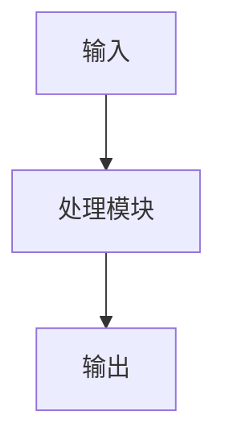

# {{技术方案名称}}

## 方案目标

说明该技术方案要支撑的业务目标或研究目标。

## 应用场景

描述方案用于什么场景、面向哪些用户、解决哪些问题。

## 总体架构

说明系统模块、数据流、Agent / Workflow / Tool 的关系。

## 核心模块

### 模块一：{{模块名称}}

- 职责：
- 输入：
- 输出：
- 依赖：

### 模块二：{{模块名称}}

- 职责：
- 输入：
- 输出：
- 依赖：

## 数据设计

|数据对象|关键字段|来源|用途|
|---|---|---|---|
| | | | |

## Workflow 设计

|Workflow|触发条件|关键步骤|输出结果|
|---|---|---|---|
| | | | |

## Agent 能力设计

- Planning：
- Tool Calling：
- Memory / Context：
- Human-in-the-loop：
- Guardrails：

## 风险控制

- 医疗安全：
- 隐私保护：
- 可追溯性：
- 人工审核：
- 异常处理：

## 评估指标

|指标|说明|验证方式|
|---|---|---|
| | | |

## 后续迭代

- 
- 
- 
